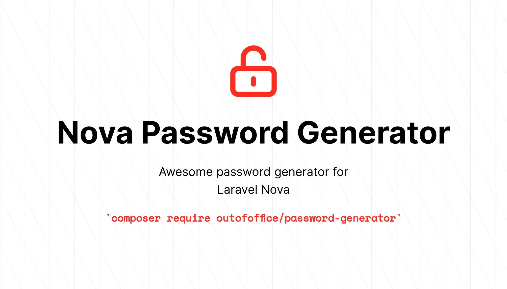
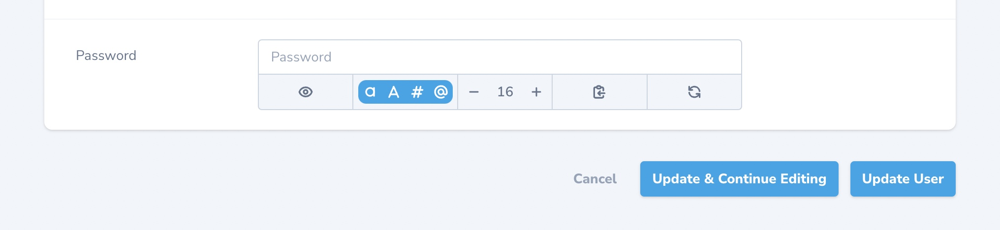

[![Latest Version on Packagist][ico-version]][link-packagist]
[![Total Downloads][ico-downloads]][link-downloads]
[![License][ico-license]][link-license]
[![Laravel Nova v4][ico-nova-v4]][link-nova-v4]

---

1. [Introduction](#introduction)
2. [Installation](#installation)
   1. [Localization](#localization)
3. [Usage](#usage)
    1. [Password Length](#password-length)
    2. [Prefix and Suffixes](#prefix-and-suffixes)
    3. [Hide Toolbar Elements](#hide-toolbar-elements)
    4. [Customize Password Generation](#customize-password-generation)
    5. [Operation Base Filling](#operation-base-filling)
    6. [Index and Detail View](#index-and-detail-view)
    7. [Other Methods](#other-methods)
4. [Credits](#credits)
5. [License](#license)

---

## Introduction

Password Generator is a custom field for Laravel Nova (v4), allowing you to add a password generator when creating or
updating resources.



Currently, you can show and hide the password. Include or exclude uppercase, lowercase, numbers and symbols from the
generated passwords. Change the password length, minimum and maximum length or total length that respects the length of
any prefix or suffix used on in the password. Easily copy it to your clipboard and regenerate passwords when you update
the options or manually via the button.

Below you will find some more information about the [usage](#usage) of this field.

## Installation

Install this package via composer:

``` bash
$ composer require outofoffice/password-generator
```

### Localization

Publish the package language files to your application's `resources/lang/vendor` directory:

```
php artisan vendor:publish --provider="OutOfOffice\PasswordGenerator\FieldServiceProvider"
```

## Usage

You can use the `PasswordGenerator` field just like the built-in `Password` field, within your Nova Resources.

```php
// in app/Nova/[Resource].php

use OutOfOffice\PasswordGenerator\PasswordGenerator;

public function fields()
{
    return [

        PasswordGenerator::make( 'Password' )
            ->onlyOnForms()
            ->creationRules( 'required', Rules\Password::defaults() )
            ->updateRules( 'nullable', Rules\Password::defaults() ),

    ];
}
```

There are plenty of optional chain-methods you could add to change the functionality and visuals of the field itself.

Below will show the methods defaults, they're only used when added to the method chain. So some defaults will not
reflect the actual field defaults when no meta is passed to it. For example, using `fillOnCreate()`
will have a default of true when using the method, but this is not enabled by default within the actual default field
options itself. Unless otherwise stated, with phrases like `Enabled/Disabled by default` or
`Included/Excluded by default` These methods are meant to allow you to set your own defaults.

### Password Length

You can determine the password length, be it generally, totally or the minimum and maximum lengths.

```php
// in app/Nova/[Resource].php

use OutOfOffice\PasswordGenerator\PasswordGenerator;

public function fields()
{
    return [

        PasswordGenerator::make( 'Password' )
            // Password length, not respecting prefix or suffix length
            ->length( int $length = 16 )
            // Overrides general length, respects prefix or suffix length
            ->totalLength( int $length = 24 )
            // Generated passwords will be minimum of this value
            ->minLength( int $minLength = 8 )
            // Generated passwords will be maximum of this value
            ->maxLength( int $maxLength = 128 )
            // Length should increment by this value when changing length via field
            ->lengthIncrementSteps( int $lengthSteps = 4 ),

    ];
}
```

### Prefix and Suffixes

Want to customize the password a bit? You can use the `prefix()` and `suffix()` or `postfix()` methods to add a custom
string to the beginning or end of a password. If you use the `totalLength()` method as well you will ensure the length
of the password respects your prefix and/or suffix.

```php
// in app/Nova/[Resource].php

use OutOfOffice\PasswordGenerator\PasswordGenerator;

public function fields()
{
    return [

        PasswordGenerator::make( 'Password' )
            // Generated passwords will start with this value (e.g. 'ooo.jX90')
            ->prefix( 'ooo.' ) // default: ''
            // Generated passwords will end with this value (e.g. 'jX90.ooo')
            ->suffix( '.ooo' ), // default: ''

    ];
}
```

### Hide Toolbar Elements

Sometimes you may think the option toolbar is too long or is overkill for your app. You can easily decide to hide any or
all of the toolbar elements, as well as keep some functionality with other methods listed below.

```php
// in app/Nova/[Resource].php

use OutOfOffice\PasswordGenerator\PasswordGenerator;

public function fields()
{
    return [

        PasswordGenerator::make( 'Password' )
            // Hide all toolbar elements, or combo this method with other
            // methods to display only one or two elements
            ->hideAllExtras( bool $hide = true )
            // Hide the show password button from the toolbar, or don't
            ->hideShowPasswordToggle( bool $hide = true )
            // Hide the password generation options from the toolbar, or don't
            ->hideOptionsToggles( bool $hide = true )
            // Hide the password length input from the toolbar, or don't
            ->hideLengthInput( bool $hide = true )
            // Hide the copy password button from the toolbar, or don't
            ->hideCopyPasswordButton( bool $hide = true )
            // Hide the refresh/regenerate password button from the toolbar, or don't
            ->hideRegenerateButton( bool $hide = true ),

    ];
}
```

### Customize Password Generation

Depending on your requirements, you might need to include or exclude specific characters from the final charlist used to
generate passwords. Use the following methods to accomplish that.

```php
// in app/Nova/[Resource].php

use OutOfOffice\PasswordGenerator\PasswordGenerator;

public function fields()
{
    return [

        PasswordGenerator::make( 'Password' )
            // Included by default, you can exclude all uppercase characters (e.g. ABC)
            ->excludeUppercase( bool $exclude = true )
            // Included by default, you can exclude all lowercase characters (e.g. abc)
            ->excludeLowercase( bool $exclude = true )
            // Included by default, you can exclude all numbers characters (e.g. 123)
            ->excludeNumbers( bool $exclude = true )
            // Included by default, you can exclude all symbols characters (e.g. $@!)
            ->excludeSymbols( bool $exclude = true )
            // Excluded by default, you can exclude characters that may look similar
            // (e.g. "i, l, 1, L, o, 0, O")
            ->excludeSimilar( bool $exclude = true )
            // Excluded by default, you can exclude ambiguous symbols
            // (e.g. "{ } [ ] ( ) / \ ' " ` ~ , ; : . < >")
            ->excludeAmbiguous( bool $exclude = true ),
            // One method to exclude multiple options, accepts the following:
            // 'uppercase' or 'upper', 'lowercase' or 'lower', 'numbers' or 'digits',
            // 'symbols' or 'special', 'similar', 'ambiguous'
            ->excludeRules( array $excludeRules ),
            // Customize the character list for the generated password, just pass
            // a string to this method, check PasswordGenerator class for more charlists
            // using this method auto-hides the option element from the toolbar
            ->customCharlist( string $charlist = PasswordGenerator::BASE16_MOD )

    ];
}
```

### Operation Base Filling

Sometimes you may want to autofill the password when the page is loaded, but usually you don't want to update the
passwords when you're editing a resource. But we still have methods for both use-cases.

```php
// in app/Nova/[Resource].php

use OutOfOffice\PasswordGenerator\PasswordGenerator;

public function fields()
{
    return [

        PasswordGenerator::make( 'Password' )
            // Disabled by default, will fill input with generated password on load
            // only when creating a new resource.
            ->fillOnCreate( bool $enabled = true )
            // Disabled by default, will fill input with generated password on load
            // only when updating a new resource.
            ->fillOnUpdate( bool $enabled = true ),

    ];
}
```

### Index and Detail View

You can now show the value of your field on the index or detail pages, usually you wouldn't want to do this
if you're using this field for passwords. But with other use-cases like tokens and such, this would be great.
Since there's a detail field now, you can use this within the resource preview modal.

```php
// in app/Nova/[Resource].php

use OutOfOffice\PasswordGenerator\PasswordGenerator;

public function fields()
{
    return [

        PasswordGenerator::make( 'Personal Access Token' )
            // Show the password as plain-text by default on the respective pages
            // These two methods work well with the others as they just show the password
            // on page load, you can use the other methods below for the styling
            ->showValueOnDetail( bool $show = true )
            ->showValueOnIndex( bool $show = true )
            // Hide the password with a blur effect on the respective pages
            ->blurValueOnDetail( bool $show = true )
            ->blurValueOnIndex( bool $show = true )
            // Hide the password with a set character on the respective pages
            ->redactValueOnDetail( bool $redact = true, string $character = '•' )
            ->redactValueOnIndex( bool $redact = true, string $character = '•' )

    ];
}
```

### Other Methods

Just a list of other miscellaneous methods to control smaller features.

```php
// in app/Nova/[Resource].php

use OutOfOffice\PasswordGenerator\PasswordGenerator;

public function fields()
{
    return [

        PasswordGenerator::make( 'Password' )
            // Show the password as plain-text in the password field by default
            ->showPassword( bool $show = true )
            // Should the password be regenerated when an option is changed
            ->regenerateOnToggle( bool $enabled = true )
            // Should the toolbar be placed above the password field
            ->toolbarOnTop( bool $toolbarOnTop = true )
            // Disable the side toolbar, only displaying it above or below the password field
            ->disableSideToolbar( bool $disable = true ),
            // Disable hashing the field value while saving to the database
            // Always hash your users passwords! This is for other non-sensitive use-cases
            ->saveAsPlainText( bool $plainText = true ),

    ];
}
```

## Credits

- [Out of Office][link-company]
- [Miguel Batres][link-author]
- [Package Banner][link-beyondcode-banners] by BeyondCode

## License

MIT - Please see the [license file](license.md) for more information.

[ico-version]: https://img.shields.io/packagist/v/outofoffice/password-generator.svg?style=flat-square

[ico-downloads]: https://img.shields.io/packagist/dt/outofoffice/password-generator.svg?style=flat-square

[ico-license]: https://img.shields.io/packagist/l/outofoffice/password-generator?style=flat-square

[ico-nova-v4]: https://img.shields.io/badge/nova-v4-333?logo=laravel-nova&style=flat-square

[link-packagist]: https://packagist.org/packages/outofoffice/password-generator

[link-downloads]: https://packagist.org/packages/outofoffice/password-generator

[link-author]: https://github.com/btrsco

[link-company]: https://github.com/oooholdings

[link-license]: https://github.com/oooholdings/nova-password-generator/blob/master/license.md

[link-nova-v4]: https://nova.laravel.com/docs/4.0/

[link-contributors]: https://github.com/oooholdings/nova-password-generator/contributors

[link-beyondcode-banners]: https://banners.beyondco.de/
